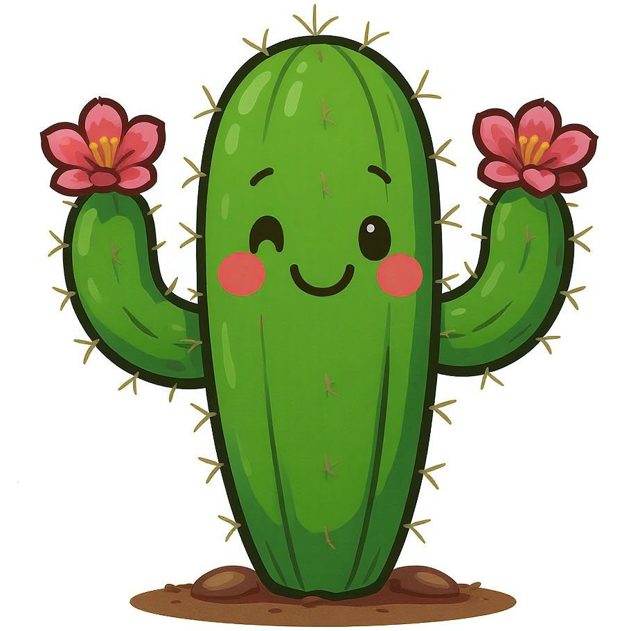

# ASCII Animations 🎨

**[🏆 Winner of the AI HACK NIGHT Agent Vs Agent Mini Hackathon](https://luma.com/pke5xlr9)**

Transform images into animated ASCII art using Gemini 2.5 Flash's image generation capabilities.

## What it does

This library takes any image and generates ASCII art animations.

## Examples

### Frog Animation
**Input:**


**Output:**


### Cactus Animation
**Input:**



**Output:**


## Getting Started

Install the dependencie using uv:

```bash
uv sync
```

Run the script:

```bash
python main.py
```

Requires an LLM Gateway API key. Put your API key in a `.env` file. (See `.env_example`)

## Hackathon

View the hackathon details [here](https://luma.com/pke5xlr9)